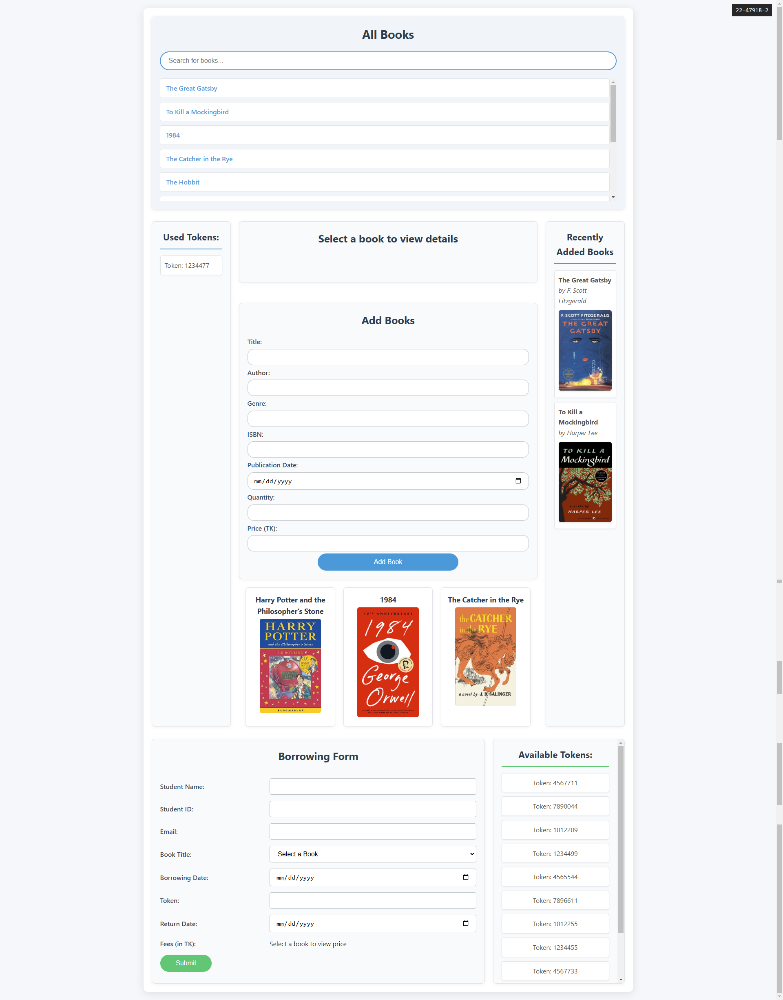

# Book Borrow System

The Book Borrow System is a web application designed to manage the borrowing books from a library. It allows users to search for books, borrow them efficiently.

## Features
- Search for books by title, author, or genre
- Add/Update/delete books
- Borrow and return books
- View borrowing history as Cookie
- View available & used Tokens
- View recently added books
- Load random books on small-div

## Screenshots

### Main Page


## Installation
1. Clone the repository to xampp/htdocs:
    ```bash
    git clone https://github.com/ZIDAN44/BookBorrowingSystem.git
    ```
2. Navigate to the project directory:
    ```bash
    cd BookBorrowingSystem
    ```
3. Open browser and go to:
    ```bash
    http://localhost/BookBorrowingSystem
    ```

## Usage
1. Search for books using the search bar.
2. Click on the book to view details/update/delete.
3. Borrow a book by filling form & clicking the "Borrow" button.
4. Use tokens if borrowing exceeded more than 10 days.
5. View your borrowed books and return them when done.
6. Borrowed book will be saved as Cookie.

## Contributing
Contributions are welcome! Please fork the repository and submit a pull request.

## License
This project is licensed under the MIT License. See the [LICENSE](LICENSE) file for details.

## Contact
For any questions or feedback, please contact [zidan@tmapparelsbd.net](mailto:zidan@tmapparelsbd.net).
